# Diagrammes UML — LogiWay

> Générés avec PlantUML  
> Contenu : Diagramme de classes + Diagramme de cas d'utilisation

---

## 1. Diagramme de Classes


```plantuml
@startuml LogiWay_Class_Diagram

' ════════ Style ════════
skinparam backgroundColor #F8F9FA
skinparam defaultFontName Arial
skinparam defaultFontSize 11
skinparam linetype ortho

skinparam class {
    BackgroundColor #FFFFFF
    BorderColor #2C3E50
    FontColor #2C3E50
    HeaderBackgroundColor #2C3E50
    HeaderFontColor #FFFFFF
    FontSize 11
}
skinparam abstractclass {
    BackgroundColor #F0F0F0
    BorderColor #2C3E50
    FontColor #2C3E50
    HeaderBackgroundColor #2C3E50
    HeaderFontColor #FFFFFF
    FontStyle italic
    FontSize 11
}
skinparam enum {
    BackgroundColor #FFF8E1
    BorderColor #F39C12
    FontColor #2C3E50
    HeaderBackgroundColor #F39C12
    HeaderFontColor #FFFFFF
    FontSize 10
}
skinparam arrow {
    Color #34495E
    FontColor #34495E
    FontSize 10
}
skinparam package {
    BackgroundColor #ECF0F1
    BorderColor #7F8C8D
    FontColor #2C3E50
    FontSize 13
    FontStyle bold
    RoundCorner 10
}
skinparam note {
    BackgroundColor #FFF9E6
    BorderColor #F39C12
    FontColor #2C3E50
    FontSize 10
}

' ════════ Package Métier ════════
package "LogiWay — Modèle Métier" as metier {

    ' ── Enumérations ──
    enum Role {
        SUPERADMIN
        MANAGER
        CHAUFFEUR
    }

    enum StatutCompte {
        ACTIF
        INACTIF
        REJETE
    }

    enum StatutChauffeur {
        EN_SERVICE
        LIBRE
    }

    enum StatutVehicule {
        EN_SERVICE
        EN_MAINTENANCE
        HORS_SERVICE
    }

    enum StatutTrajet {
        EN_COURS
        ACTIF
        COMPLETE
    }

    enum StatutPause {
        PLANIFIEE
        ATTEINTE
        IGNOREE
    }

    enum StatutEntreprise {
        ACTIF
        INACTIF
        EN_ATTENTE
        SUSPENDU
    }

    enum StatutReclamation {
        EN_COURS
        RESOLU
        REJETE
    }

    enum StatutConge {
        EN_ATTENTE
        APPROUVE
        REJETE
        ANNULE
    }

    enum TypePause {
        WARNING_ALERT
        MANDATORY_REST
        STATION_SERVICE
        KIOSK
        POI
        REST_AREA
    }

    enum TypeConge {
        MALADIE
        MARIAGE
        VACANCES
    }

    enum TypeNotif {
        SECTEUR
        NOTIF_COMPTE
        NOTIF_TRAJET
        NOTIF_CONGE
        NOTIF_RECLAMATION
        NOTIF_MESSAGE
        NOTIF_ENTREPRISE
        NOTIF_AFFECTATION
        NOTIF_VEHICULE
    }

    enum PrioriteTrajet {
        NORMALE
        URGENTE
        CRITIQUE
    }

    enum PrioriteReclamation {
        NORMAL
        URGENT
    }

    enum MessengerMessageStatus {
        NON_LU
        LU
    }

    enum MessengerMessageType {
        TEXTE
        IMAGE
        PDF
        VOCAL
        APPEL
    }

    ' ── ENTITÉS ─────────────────────────────────────────────

    ' ── Utilisateur (abstraite) ──
    abstract class Utilisateur {
        - id: Long
        - keycloakId: String
        - email: String
        - passwordHash: String
        - nom: String
        - prenom: String
        - telephone: String
        - pays: String
        - image: String
        - dateCreation: LocalDateTime
        - estActif: StatutCompte
        - rejectionReason: String
        - emailVerifie: Boolean
        - verificationToken: String
        - role: Role
    }

    ' ── Manager extends Utilisateur ──
    class Manager {
        + gererChauffeurs(): Set<Chauffeur>
        + gererTrajets(): Set<Trajet>
        + gererConges(): Set<Conge>
    }

    ' ── SuperAdmin extends Manager ──
    class SuperAdmin {
    }

    ' ── Chauffeur extends Utilisateur ──
    class Chauffeur {
        - statutConducteur: StatutChauffeur
        + effectuerTrajets(): Set<Trajet>
        + demanderConges(): Set<Conge>
    }

    ' ── Secteur ──
    class Secteur {
        - id: Long
        - nom: String
        - description: String
        - zoneGeographique: String
        - codesPostaux: String
        + regrouperManagers(): Set<Manager>
        + regrouperChauffeurs(): Set<Chauffeur>
    }

    ' ── Entreprise ──
    class Entreprise {
        - id: Long
        - nomEntreprise: String
        - emailEntreprise: String
        - adresseEntreprise: String
        - numeroEntreprise: String
        - codeTVA: String
        - representantLegal: String
        - documentJustificatif: String
        - image: String
        - secteurActivite: String
        - tailleFlotte: Integer
        - statut: StatutEntreprise
        - dateCreation: LocalDateTime
    }

    ' ── Véhicule ──
    class Vehicule {
        - id: Long
        - matricule: String
        - marque: String
        - modele: String
        - capacite: Double
        - latitudeActuelle: Double
        - longitudeActuelle: Double
        - dernierePositionMaj: LocalDateTime
        - vitesseActuelle: Double
        - niveauCarburant: Double
        - capaciteCharge: Double
        - couleur: String
        - kilometrage: Integer
        - statut: StatutVehicule
    }

    ' ── Trajet ──
    class Trajet {
        - id: Long
        - dateDepart: LocalDateTime
        - dateArrivee: LocalDateTime
        - pointDepart: String
        - destination: String
        - latitudeDepart: Double
        - longitudeDepart: Double
        - latitudeArrivee: Double
        - longitudeArrivee: Double
        - distanceKm: Double
        - dureeEstimeeMinutes: Integer
        - geometrieItineraire: String
        - chargeKg: Double
        - priorite: PrioriteTrajet
        - notes: String
        - dateArriveeReelle: LocalDateTime
        - statut: StatutTrajet
        - typeOptimisation: String
    }

    ' ── PauseReglementaire ──
    class PauseReglementaire {
        - id: Long
        - type: TypePause
        - longitude: Double
        - latitude: Double
        - distanceAlongRouteM: Double
        - heureArriveePlanifiee: LocalDateTime
        - durationSeconds: Integer
        - heureRepriseEstimee: LocalDateTime
        - statut: StatutPause
        - nomLieu: String
        - aiScore: Integer
        - fatigueScore: Integer
        - accessibilityScore: Integer
        - contextScore: Integer
        - reasoning: String
        - confidence: Double
    }

    ' ── Reclamation ──
    class Reclamation {
        - id: Long
        - sujet: String
        - description: String
        - priorite: PrioriteReclamation
        - statut: StatutReclamation
        - dateCreation: LocalDateTime
        - dateMiseAJour: LocalDateTime
        - commentaireResolution: String
    }

    ' ── Conge ──
    class Conge {
        - id: Long
        - dateDebut: LocalDate
        - dateFin: LocalDate
        - periode: Integer
        - motif: String
        - commentaireValidation: String
        - calendarEventId: String
        - dateCreation: LocalDateTime
        - dateMiseAJour: LocalDateTime
        - type: TypeConge
        - statut: StatutConge
    }

    ' ── Notification ──
    class Notification {
        - id: Long
        - type: TypeNotif
        - dateCreation: LocalDateTime
        - estLu: Boolean
        - message: String
    }

    ' ── MessengerMessage ──
    class MessengerMessage {
        - id: Long
        - expediteurId: Long
        - destinataireId: Long
        - contenu: String
        - type: MessengerMessageType
        - cheminFichier: String
        - nomFichierOriginal: String
        - tailleFichier: Long
        - dureeVocale: Integer
        - statut: MessengerMessageStatus
        - dateEnvoi: LocalDateTime
        - dateLecture: LocalDateTime
        - modifie: Boolean
        - dateModification: LocalDateTime
        - contenuOriginal: String
        - supprime: Boolean
        - dateSuppression: LocalDateTime
        - connecte: Boolean
        - derniereActivite: LocalDateTime
    }

    ' ── RefreshToken ──
    class RefreshToken {
        - id: Long
        - token: String
        - expiryDate: LocalDateTime
        - revoked: Boolean
        - createdAt: LocalDateTime
        + isExpired(): Boolean
        + isValid(): Boolean
    }

    ' ── ResetToken ──
    class ResetToken {
        - id: Long
        - code: String
        - expiresAt: LocalDateTime
        - used: Boolean
    }


    ' ════════ RELATIONS D'HÉRITAGE ════════

    Utilisateur <|-- Manager
    Utilisateur <|-- Chauffeur
    Manager <|-- SuperAdmin


    ' ════════ RELATIONS D'ASSOCIATION ════════

    ' ── Utilisateur ──
    Utilisateur "1" --> "*" Reclamation : "émet"
    Utilisateur "1" --> "*" Notification : "reçoit"
    Utilisateur "1" --> "0..1" RefreshToken : "possède"
    Utilisateur "1" --> "*" ResetToken : "demande"
    Utilisateur "*" --> "1" Entreprise : "appartient"
    Utilisateur "1" --> "0..1" Utilisateur : "créé par"

    ' ── Manager ──
    Manager "1" --> "*" Chauffeur : "supervise"
    Manager "1" --> "*" Trajet : "planifie"
    Manager "1" --> "*" Conge : "valide"
    Manager "1" --> "0..1" Secteur : "gère"

    ' ── Chauffeur ──
    Chauffeur "1" --> "*" Trajet : "effectue"
    Chauffeur "1" --> "0..1" Vehicule : "conduit"
    Chauffeur "1" --> "*" Conge : "demande"
    Chauffeur "1" --> "0..1" Secteur : "rattaché"
    Chauffeur "*" --> "1" Manager : "dépend de"

    ' ── Véhicule ──
    Vehicule "*" --> "1" Entreprise : "appartient"
    Vehicule "0..1" --> "1" Chauffeur : "attribué à"
    Vehicule "1" --> "*" Trajet : "utilisé dans"

    ' ── Trajet ──
    Trajet "*" --> "1" Manager : "supervisé par"
    Trajet "*" --> "1" Chauffeur : "exécuté par"
    Trajet "*" --> "1" Vehicule : "utilise"
    Trajet "1" --> "*" PauseReglementaire : "contient"

    ' ── PauseReglementaire ──
    PauseReglementaire "*" --> "1" Trajet : "rattachée"

    ' ── Secteur ──
    Secteur "1" --> "1" Entreprise : "appartient"
    Secteur "1" --> "*" Manager : "regroupe"
    Secteur "1" --> "*" Chauffeur : "regroupe"

    ' ── Reclamation ──
    Reclamation "*" --> "1" Utilisateur : "créée par"

    ' ── Conge ──
    Conge "*" --> "1" Chauffeur : "demandé par"
    Conge "*" --> "1" Manager : "traité par"

    ' ── MessengerMessage ──
    MessengerMessage "*" --> "1" Utilisateur : "envoyé par"
    MessengerMessage "*" --> "1" Utilisateur : "reçu par"


    ' ════════ NOTES ════════

    note top of SuperAdmin
        **SuperAdmin** hérite de **Manager**
        = toutes les capacités du Manager +
        Valider les entreprises
        Gérer tous les utilisateurs
        Configurer le système
        Consulter les logs
    end note

    note top of Utilisateur : Classe abstraite (JOINED)

    legend bottom
        |= Symbole |= Signification |
        | #2C3E50 <|-- | Héritage |
        | #34495E --> | Association |
        | 1 * | Cardinalité |
    end legend

}

@enduml
```

---

## 2. Diagramme de Cas d'Utilisation


```plantuml
@startuml LogiWay_UseCase_Diagram
skinparam backgroundColor #F8F9FA
skinparam defaultFontName Arial
skinparam defaultFontSize 12

skinparam usecase {
    BackgroundColor #FFFFFF
    BorderColor #2C3E50
    FontColor #2C3E50
    FontSize 12
    FontStyle bold
}
skinparam actor {
    BackgroundColor #FFFFFF
    BorderColor #2C3E50
    FontColor #2C3E50
    FontSize 13
    FontStyle bold
}
skinparam arrow {
    Color #34495E
    FontColor #34495E
    FontSize 10
}
skinparam package {
    BackgroundColor #ECF0F1
    BorderColor #7F8C8D
    FontColor #2C3E50
    FontSize 13
    FontStyle bold
}
skinparam rectangle {
    BackgroundColor #ECF0F1
    BorderColor #7F8C8D
    FontColor #2C3E50
    FontSize 12
    FontStyle bold
    RoundCorner 10
}
skinparam note {
    BackgroundColor #FFF9E6
    BorderColor #F39C12
    FontColor #2C3E50
}

left to right direction
title **LogiWay — Diagramme de Cas d'Utilisation**

' ── Acteurs ──
actor "SuperAdmin" as sa #FF6B6B
actor "Manager" as m #4ECDC4
actor "Chauffeur" as c #45B7D1

rectangle "Système de Gestion de Flotte Logistique" as sys {

    ' ══════════════════ Tous les utilisateurs ══════════════════
    usecase "S'authentifier" as UC_AUTH
    usecase "Modifier son profil" as UC_PROFIL
    usecase "Recevoir des notifications" as UC_NOTIF_ALL

    ' ══════════════════ Gestion Supra (SuperAdmin only) ══════════════════
    rectangle "Administration Système" as adm {
        usecase "Valider une\nentreprise" as UC_VAL_ENT
        usecase "Gérer les\nutilisateurs" as UC_GER_USER
        usecase "Consulter\nles logs" as UC_LOGS
        usecase "Configurer\nle système" as UC_CONFIG
    }

    ' ══════════════════ Gestion Opérationnelle (Manager + SuperAdmin) ══════════════════
    rectangle "Gestion Opérationnelle" as ops {
        usecase "Traiter une\nréclamation" as UC_RECLAM
        usecase "Modifier statut\nchauffeur" as UC_STAT_CHAUF
        usecase "Gérer\ndes trajets" as UC_TRAJETS
        usecase "Gérer\ndes véhicules" as UC_FLOTTE
        usecase "Consulter le\nDashboard" as UC_DASH
        usecase "Gérer\nles secteurs" as UC_SECTEUR
        usecase "Générer des\nrapports" as UC_RAPPORT
        usecase "Planifier des\ntournées" as UC_TOURNEE
    }

    ' ══════════════════ Activités Chauffeur ══════════════════
    rectangle "Activités Conducteur" as cond {
        usecase "Consulter trajets\nassignés" as UC_VOIR_TRAJ
        usecase "Démarrer\nun trajet" as UC_START
        usecase "Terminer\nun trajet" as UC_END
        usecase "Consulter\nles pauses" as UC_PAUSE
        usecase "Signaler\nun problème" as UC_SIGNAL
        usecase "Voir\nses notifications" as UC_NOTIF
    }
}

' ══════════════════ Relations — SuperAdmin ══════════════════
sa --> UC_AUTH
sa --> UC_PROFIL
sa --> UC_NOTIF_ALL

sa --> UC_VAL_ENT
sa --> UC_GER_USER : "inclut"
sa --> UC_LOGS
sa --> UC_CONFIG

sa --> UC_RECLAM
sa --> UC_STAT_CHAUF
sa --> UC_TRAJETS
sa --> UC_FLOTTE
sa --> UC_DASH
sa --> UC_SECTEUR
sa --> UC_RAPPORT
sa --> UC_TOURNEE

' ══════════════════ Relations — Manager ══════════════════
m --> UC_AUTH
m --> UC_PROFIL
m --> UC_NOTIF_ALL

m --> UC_RECLAM : "traite"
m --> UC_STAT_CHAUF : "modifie"
m --> UC_TRAJETS
m --> UC_FLOTTE
m --> UC_DASH
m --> UC_SECTEUR
m --> UC_RAPPORT
m --> UC_TOURNEE

' ══════════════════ Relations — Chauffeur ══════════════════
c --> UC_AUTH
c --> UC_PROFIL
c --> UC_NOTIF_ALL

c --> UC_VOIR_TRAJ
c --> UC_START
c --> UC_END
c --> UC_PAUSE
c --> UC_SIGNAL
c --> UC_NOTIF

' ══════════════════ Notes ══════════════════
note right of UC_RECLAM
    **Manager** : réclamations
    de ses chauffeurs uniquement

    **SuperAdmin** : toutes
    les réclamations (global)
end note

note right of UC_STAT_CHAUF
    Le Manager ne peut modifier
    que ses propres chauffeurs
end note

note left of UC_VAL_ENT
    Seul le SuperAdmin
    peut valider une
    nouvelle entreprise
end note

note bottom of UC_GER_USER
    Création, modification
    et suppression de
    tous les comptes
end note

' ══════════════════ Légende ══════════════════
legend top left
    |= Acteur |= Rôle |
    | <#FF6B6B> SuperAdmin | Administration globale |
    | <#4ECDC4> Manager | Gestion opérationnelle |
    | <#45B7D1> Chauffeur | Exécution terrain |
end legend

@enduml
```

---

## 3. Notes sur l'Héritage SuperAdmin → Manager

```
Utilisateur (abstract)
    │
    ├── Manager
    │       │
    │       ├── SuperAdmin  ← hérite
    │
    └── Chauffeur
```

### Pourquoi SuperAdmin hérite de Manager ?

| Action | Manager | SuperAdmin |
|---|---|---|
| S'authentifier | ✅ | ✅ (hérité) |
| Traiter une réclamation | ✅ (ses chauffeurs) | ✅ (toutes) |
| Modifier statut chauffeur | ✅ (ses chauffeurs) | ✅ (tous) |
| Gérer les trajets | ✅ (son équipe) | ✅ (tous) |
| Gérer la flotte | ✅ | ✅ |
| Consulter le Dashboard | ✅ | ✅ |
| Gérer les secteurs | ✅ | ✅ |
| Valider une entreprise | ❌ | ✅ |
| Gérer les utilisateurs | ❌ | ✅ |
| Configurer le système | ❌ | ✅ |
| Consulter les logs | ❌ | ✅ |

Le SuperAdmin **hérite de toutes les capacités du Manager** et les étend avec des permissions globales. Cela permet une gestion cohérente : un SuperAdmin peut remplacer un Manager sans perte de fonctionnalité.

---

---

## 4. Diagrammes d'Activité

### 4.1 Vie du Véhicule

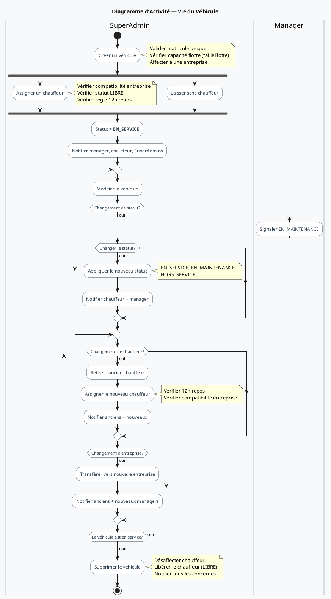
```plantuml
@startuml Vehicule_Activity
skinparam backgroundColor #F8F9FA
skinparam defaultFontName Arial
skinparam activity {
    BackgroundColor #FFFFFF
    BorderColor #2C3E50
    FontColor #2C3E50
    HeaderBackgroundColor #2C3E50
    HeaderFontColor #FFFFFF
}
skinparam swimlane {
    BackgroundColor #ECF0F1
    BorderColor #7F8C8D
    FontColor #2C3E50
}

title **Diagramme d'Activité — Vie du Véhicule**

|SuperAdmin|
start
:Créer un véhicule;
note right
  Valider matricule unique
  Vérifier capacité flotte (tailleFlotte)
  Affecter à une entreprise
end note

fork
  :Assigner un chauffeur;
  note right
    Vérifier compatibilité entreprise
    Vérifier statut LIBRE
    Vérifier règle 12h repos
  end note
fork again
  :Laisser sans chauffeur;
end fork

:Statut = **EN_SERVICE**;
:Notifier manager, chauffeur, SuperAdmins;

repeat
  :Modifier le véhicule;

  if (Changement de statut?) then (oui)
    |Manager|
    :Signaler EN_MAINTENANCE;

    |SuperAdmin|
    if (Changer le statut?) then (oui)
      :Appliquer le nouveau statut;
      note right
        EN_SERVICE, EN_MAINTENANCE,
        HORS_SERVICE
      end note
      :Notifier chauffeur + manager;
    endif
  endif

  if (Changement de chauffeur?) then (oui)
    |SuperAdmin|
    :Retirer l'ancien chauffeur;
    :Assigner le nouveau chauffeur;
    note right
      Vérifier 12h repos
      Vérifier compatibilité entreprise
    end note
    :Notifier anciens + nouveaux;
  endif

  if (Changement d'entreprise?) then (oui)
    |SuperAdmin|
    :Transférer vers nouvelle entreprise;
    :Notifier anciens + nouveaux managers;
  endif

repeat while (Le véhicule est en service?) is (oui)
-> non;

|SuperAdmin|
:Supprimer le véhicule;
note right
  Désaffecter chauffeur
  Libérer le chauffeur (LIBRE)
  Notifier tous les concernés
end note
stop

@enduml
```

---

### 4.2 Vie de la Réclamation

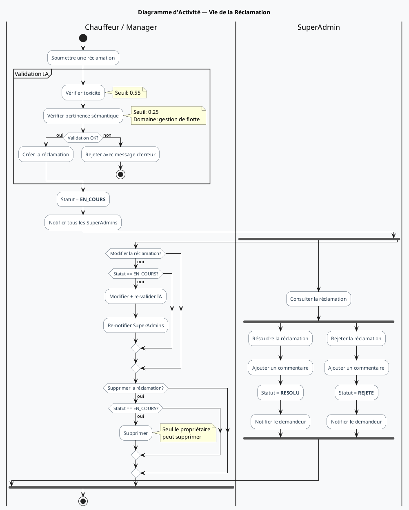
```plantuml
@startuml Reclamation_Activity
skinparam backgroundColor #F8F9FA
skinparam defaultFontName Arial
skinparam activity {
    BackgroundColor #FFFFFF
    BorderColor #2C3E50
    FontColor #2C3E50
}

title **Diagramme d'Activité — Vie de la Réclamation**

|Chauffeur / Manager|
start
:Soumettre une réclamation;

partition "Validation IA" {
  :Vérifier toxicité;
  note right: Seuil: 0.55
  :Vérifier pertinence sémantique;
  note right: Seuil: 0.25\nDomaine: gestion de flotte
  if (Validation OK?) then (oui)
    :Créer la réclamation;
  else (non)
    :Rejeter avec message d'erreur;
    stop
  endif
}

:Statut = **EN_COURS**;
:Notifier tous les SuperAdmins;

|SuperAdmin|
fork
  :Consulter la réclamation;

  fork
    :Résoudre la réclamation;
    :Ajouter un commentaire;
    :Statut = **RESOLU**;
    :Notifier le demandeur;
  fork again
    :Rejeter la réclamation;
    :Ajouter un commentaire;
    :Statut = **REJETE**;
    :Notifier le demandeur;
  end fork

fork again
  |Chauffeur / Manager|
  if (Modifier la réclamation?) then (oui)
    if (Statut == EN_COURS?) then (oui)
      :Modifier + re-valider IA;
      :Re-notifier SuperAdmins;
    endif
  endif

  if (Supprimer la réclamation?) then (oui)
    if (Statut == EN_COURS?) then (oui)
      :Supprimer;
      note right: Seul le propriétaire\npeut supprimer
    endif
  endif
end fork

stop

@enduml
```

---

### 4.3 Vie du Congé

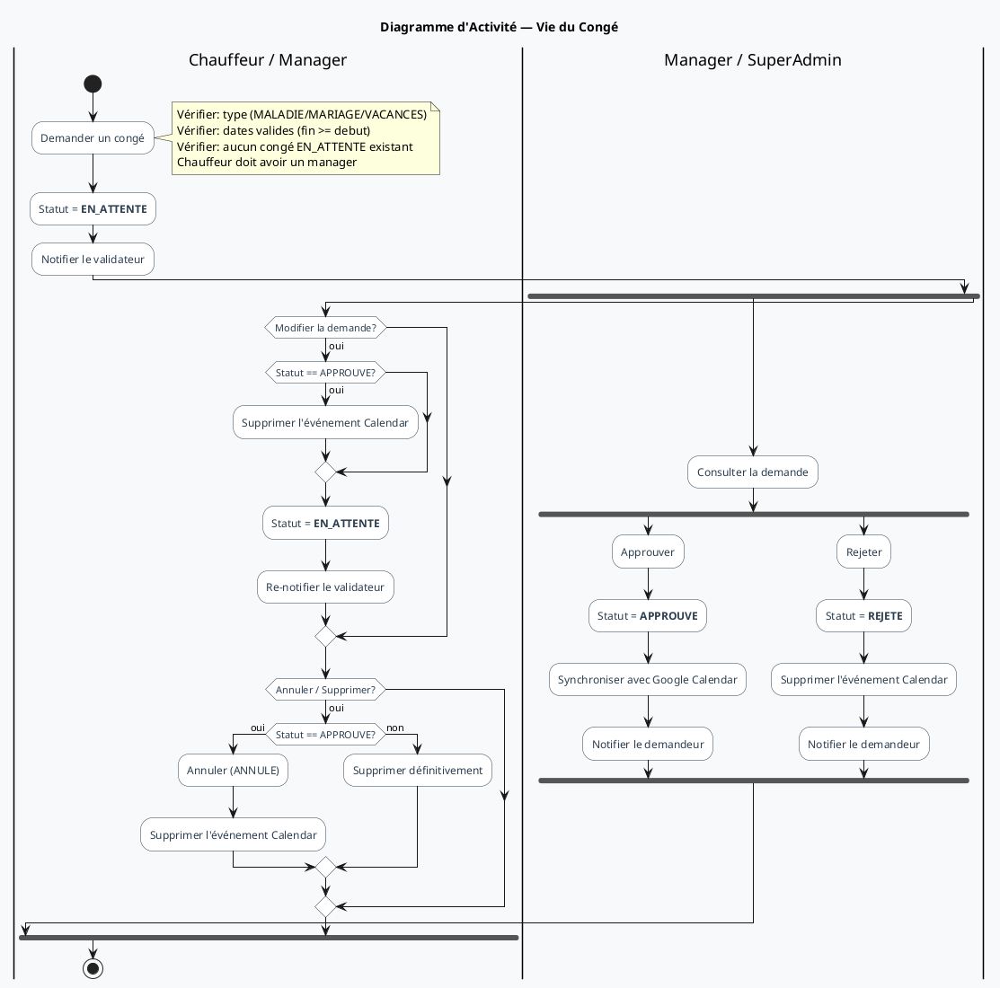
```plantuml
@startuml Conge_Activity
skinparam backgroundColor #F8F9FA
skinparam defaultFontName Arial
skinparam activity {
    BackgroundColor #FFFFFF
    BorderColor #2C3E50
    FontColor #2C3E50
}

title **Diagramme d'Activité — Vie du Congé**

|Chauffeur / Manager|
start
:Demander un congé;
note right
  Vérifier: type (MALADIE/MARIAGE/VACANCES)
  Vérifier: dates valides (fin >= debut)
  Vérifier: aucun congé EN_ATTENTE existant
  Chauffeur doit avoir un manager
end note

:Statut = **EN_ATTENTE**;
:Notifier le validateur;

|Manager / SuperAdmin|
fork
  :Consulter la demande;

  fork
    :Approuver;
    :Statut = **APPROUVE**;
    :Synchroniser avec Google Calendar;
    :Notifier le demandeur;
  fork again
    :Rejeter;
    :Statut = **REJETE**;
    :Supprimer l'événement Calendar;
    :Notifier le demandeur;
  end fork

fork again
  |Chauffeur / Manager|
  if (Modifier la demande?) then (oui)
    if (Statut == APPROUVE?) then (oui)
      :Supprimer l'événement Calendar;
    endif
    :Statut = **EN_ATTENTE**;
    :Re-notifier le validateur;
  endif

  if (Annuler / Supprimer?) then (oui)
    if (Statut == APPROUVE?) then (oui)
      :Annuler (ANNULE);
      :Supprimer l'événement Calendar;
    else (non)
      :Supprimer définitivement;
    endif
  endif
end fork

stop

@enduml
```

---

### 4.4 Vie du Messenger

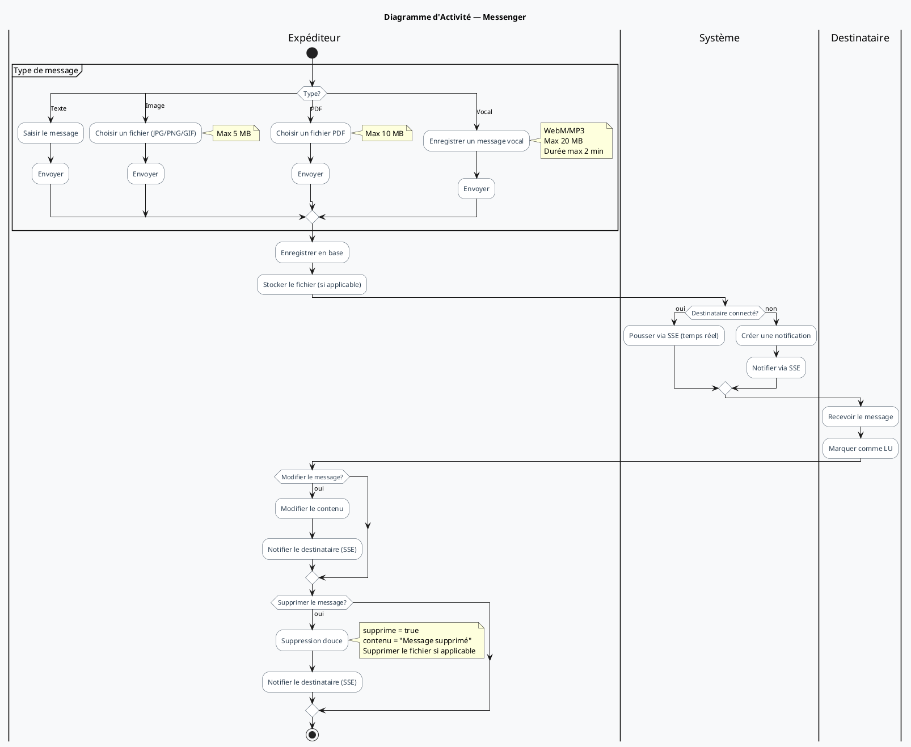
```plantuml
@startuml Messenger_Activity
skinparam backgroundColor #F8F9FA
skinparam defaultFontName Arial
skinparam activity {
    BackgroundColor #FFFFFF
    BorderColor #2C3E50
    FontColor #2C3E50
}

title **Diagramme d'Activité — Messenger**

|Expéditeur|
start

partition "Type de message" {
  switch (Type?)
  case (Texte)
    :Saisir le message;
    :Envoyer;
  case (Image)
    :Choisir un fichier (JPG/PNG/GIF);
    note right: Max 5 MB
    :Envoyer;
  case (PDF)
    :Choisir un fichier PDF;
    note right: Max 10 MB
    :Envoyer;
  case (Vocal)
    :Enregistrer un message vocal;
    note right: WebM/MP3\nMax 20 MB\nDurée max 2 min
    :Envoyer;
  endswitch
}

:Enregistrer en base;
:Stocker le fichier (si applicable);

|Système|
if (Destinataire connecté?) then (oui)
  :Pousser via SSE (temps réel);
else (non)
  :Créer une notification;
  :Notifier via SSE;
endif

|Destinataire|
:Recevoir le message;
:Marquer comme LU;

|Expéditeur|
if (Modifier le message?) then (oui)
  :Modifier le contenu;
  :Notifier le destinataire (SSE);
endif

if (Supprimer le message?) then (oui)
  :Suppression douce;
  note right
    supprime = true
    contenu = "Message supprimé"
    Supprimer le fichier si applicable
  end note
  :Notifier le destinataire (SSE);
endif

stop

@enduml
```

---

### 4.5 Vie de l'Entreprise

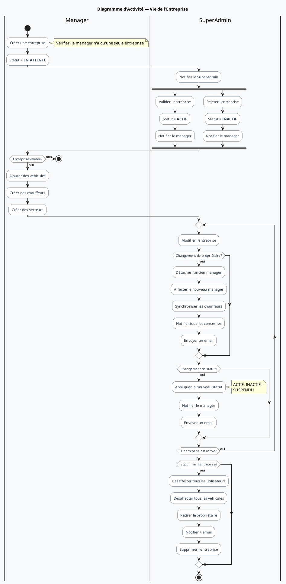
```plantuml
@startuml Entreprise_Activity
skinparam backgroundColor #F8F9FA
skinparam defaultFontName Arial
skinparam activity {
    BackgroundColor #FFFFFF
    BorderColor #2C3E50
    FontColor #2C3E50
}

title **Diagramme d'Activité — Vie de l'Entreprise**

|Manager|
start
:Créer une entreprise;
note right
  Vérifier: le manager n'a qu'une seule entreprise
end note

:Statut = **EN_ATTENTE**;

|SuperAdmin|
:Notifier le SuperAdmin;

fork
  :Valider l'entreprise;
  :Statut = **ACTIF**;
  :Notifier le manager;

fork again
  :Rejeter l'entreprise;
  :Statut = **INACTIF**;
  :Notifier le manager;
end fork

|Manager|
if (Entreprise validée?) then (oui)
  :Ajouter des véhicules;
  :Créer des chauffeurs;
  :Créer des secteurs;
else (non)
  stop
endif

|SuperAdmin|
repeat
  :Modifier l'entreprise;

  if (Changement de propriétaire?) then (oui)
    :Détacher l'ancien manager;
    :Affecter le nouveau manager;
    :Synchroniser les chauffeurs;
    :Notifier tous les concernés;
    :Envoyer un email;
  endif

  if (Changement de statut?) then (oui)
    :Appliquer le nouveau statut;
    note right
      ACTIF, INACTIF,
      SUSPENDU
    end note
    :Notifier le manager;
    :Envoyer un email;
  endif

repeat while (L'entreprise est active?) is (oui)

if (Supprimer l'entreprise?) then (oui)
  :Désaffecter tous les utilisateurs;
  :Désaffecter tous les véhicules;
  :Retirer le propriétaire;
  :Notifier + email;
  :Supprimer l'entreprise;
endif

stop

@enduml
```

---

### 4.6 Vie du Secteur

```plantuml
@startuml Secteur_Activity
skinparam backgroundColor #F8F9FA
skinparam defaultFontName Arial
skinparam activity {
    BackgroundColor #FFFFFF
    BorderColor #2C3E50
    FontColor #2C3E50
}

title **Diagramme d'Activité — Vie du Secteur**

|SuperAdmin|
start
:Créer un secteur;
note right
  Vérifier: nom unique dans l'entreprise
  Lier à une entreprise
  Optionnel: assigner un manager
end note

repeat
  :Modifier le secteur;

  if (Changement d'entreprise?) then (oui)
    :Détacher tous les managers;
    :Détacher tous les chauffeurs;
    :Notifier les concernés;
  endif

repeat while (Le secteur existe?) is (oui)

fork
  :Gérer les managers;
  note right
    Assigner / Retirer un manager
    Définir le manager du secteur
  end note

fork again
  :Gérer les chauffeurs;
  note right
    Assigner / Retirer un chauffeur
    Définir le secteur du chauffeur
  end note
end fork

if (Supprimer le secteur?) then (oui)
  if (Des managers ou chauffeurs assignés?) then (oui)
    :Bloquer la suppression;
    :Afficher erreur;
  else (non)
    :Supprimer le secteur;
  endif
endif

stop

note right of :**Résolution du secteur chauffeur**
  Priorité:
  1. Affectation directe
  2. Secteur du manager
  3. Premier secteur de l'entreprise
end note

@enduml
```

---

### 4.7 Vie du Trajet

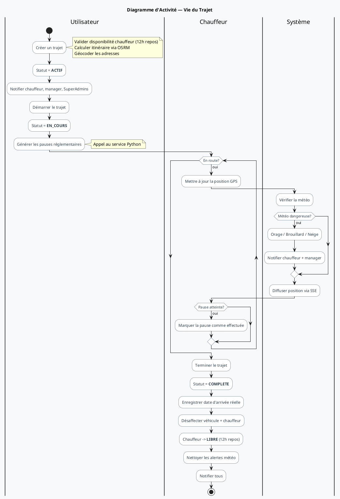
```plantuml
@startuml Trajet_Activity
skinparam backgroundColor #F8F9FA
skinparam defaultFontName Arial
skinparam activity {
    BackgroundColor #FFFFFF
    BorderColor #2C3E50
    FontColor #2C3E50
}

title **Diagramme d'Activité — Vie du Trajet**

|Utilisateur|
start
:Créer un trajet;
note right
  Valider disponibilité chauffeur (12h repos)
  Calculer itinéraire via OSRM
  Géocoder les adresses
end note

:Statut = **ACTIF**;
:Notifier chauffeur, manager, SuperAdmins;

:Démarrer le trajet;
:Statut = **EN_COURS**;
:Générer les pauses réglementaires;
note right: Appel au service Python

|Chauffeur|
while (En route?) is (oui)
  :Mettre à jour la position GPS;
  |Système|
  :Vérifier la météo;
  if (Météo dangereuse?) then (oui)
    :Orage / Brouillard / Neige;
    :Notifier chauffeur + manager;
  endif
  :Diffuser position via SSE;
  |Chauffeur|
  if (Pause atteinte?) then (oui)
    :Marquer la pause comme effectuée;
  endif
endwhile

:Terminer le trajet;
:Statut = **COMPLETE**;
:Enregistrer date d'arrivée réelle;
:Désaffecter véhicule + chauffeur;
:Chauffeur -> **LIBRE** (12h repos);
:Nettoyer les alertes météo;
:Notifier tous;

stop

@enduml
```

---

### 4.8 Authentification

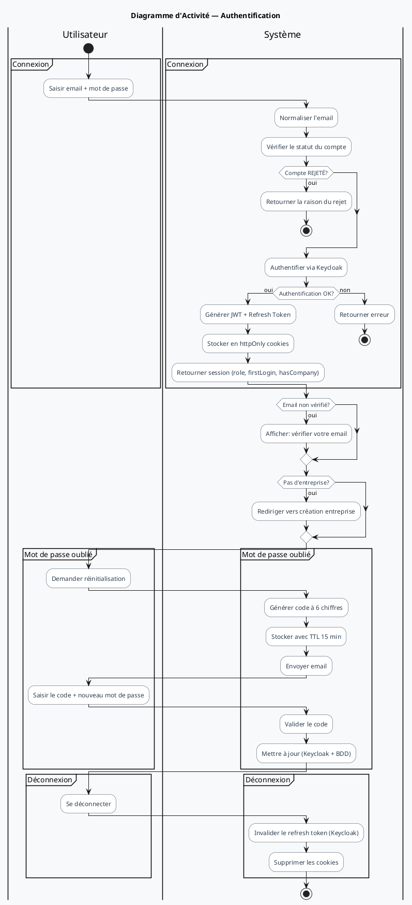
```plantuml
@startuml Auth_Activity
skinparam backgroundColor #F8F9FA
skinparam defaultFontName Arial
skinparam activity {
    BackgroundColor #FFFFFF
    BorderColor #2C3E50
    FontColor #2C3E50
}

title **Diagramme d'Activité — Authentification**

|Utilisateur|
start

partition "Connexion" {
  :Saisir email + mot de passe;
  |Système|
  :Normaliser l'email;
  :Vérifier le statut du compte;

  if (Compte REJETÉ?) then (oui)
    :Retourner la raison du rejet;
    stop
  endif

  :Authentifier via Keycloak;

  if (Authentification OK?) then (oui)
    :Générer JWT + Refresh Token;
    :Stocker en httpOnly cookies;
    :Retourner session (role, firstLogin, hasCompany);
  else (non)
    :Retourner erreur;
    stop
  endif
}

if (Email non vérifié?) then (oui)
  :Afficher: vérifier votre email;
endif

if (Pas d'entreprise?) then (oui)
  :Rediriger vers création entreprise;
endif

partition "Mot de passe oublié" {
  |Utilisateur|
  :Demander réinitialisation;
  |Système|
  :Générer code à 6 chiffres;
  :Stocker avec TTL 15 min;
  :Envoyer email;
  |Utilisateur|
  :Saisir le code + nouveau mot de passe;
  |Système|
  :Valider le code;
  :Mettre à jour (Keycloak + BDD);
}

partition "Déconnexion" {
  |Utilisateur|
  :Se déconnecter;
  |Système|
  :Invalider le refresh token (Keycloak);
  :Supprimer les cookies;
}

stop

@enduml
```

---

### 4.9 Notifications

```plantuml
@startuml Notification_Activity
skinparam backgroundColor #F8F9FA
skinparam defaultFontName Arial
skinparam activity {
    BackgroundColor #FFFFFF
    BorderColor #2C3E50
    FontColor #2C3E50
}

title **Diagramme d'Activité — Système de Notifications**

start

partition "Création" {
  :Un événement se produit;
  note right
    Congé, Réclamation, Véhicule,
    Trajet, Message, Entreprise,
    Secteur, Compte
  end note
  :Identifier les destinataires;
  :Adapter le message au rôle;
  note right
    NotificationMessageResolver
    adapte le texte selon
    CHAUFFEUR/MANAGER/SUPERADMIN
  end note
  :Créer la notification en base;
}

partition "Diffusion temps réel" {
  :Vérifier les connexions SSE;
  if (Destinataire connecté?) then (oui)
    :Pousser via SSE;
    :Jouer le son (NotificationToneResolver);
  else (non)
    :La notification reste en attente;
  endif
}

partition "Consultation" {
  |Utilisateur|
  :Consulter les notifications;
  :Filtrer par type / non-lues;
  :Marquer comme lues;
}

stop

@enduml
```

---

## 5. Diagrammes de Séquence

### 5.1 Créer un Véhicule

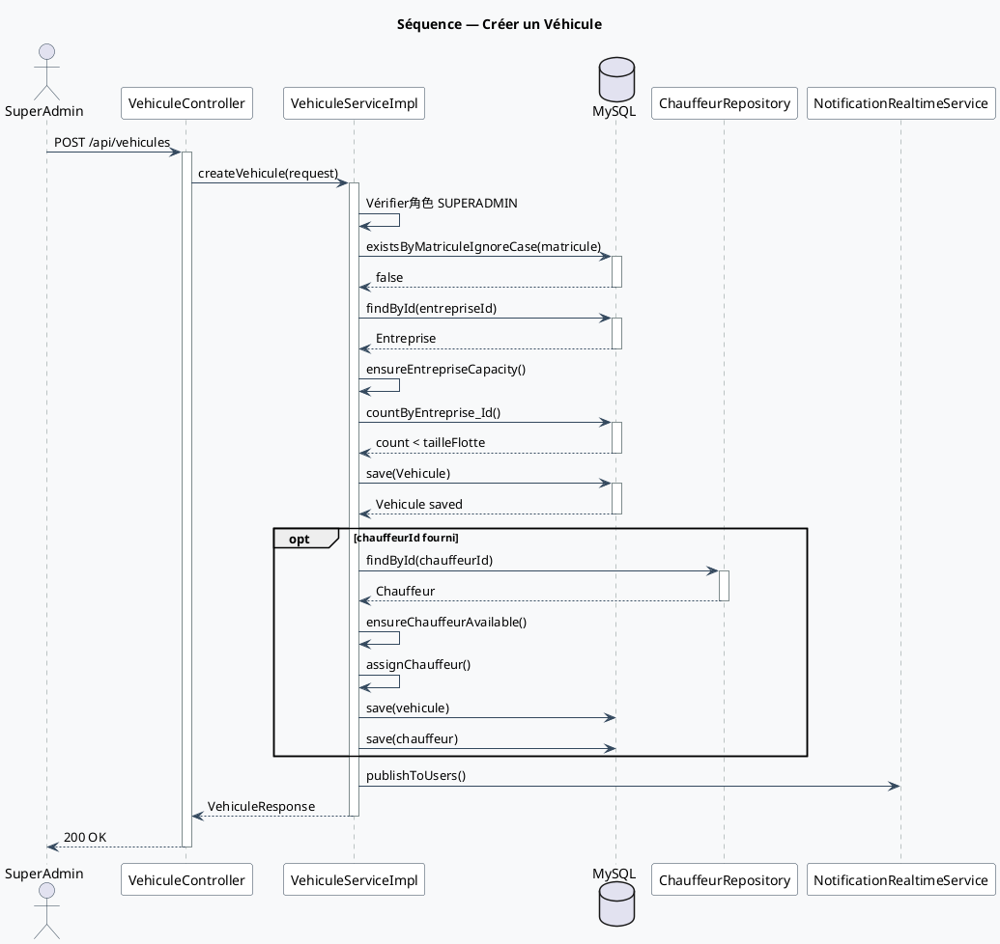
```plantuml
@startuml Seq_Create_Vehicule
skinparam backgroundColor #F8F9FA
skinparam defaultFontName Arial
skinparam sequence {
    ArrowColor #34495E
    ActorBorderColor #2C3E50
    LifeLineBorderColor #7F8C8D
    ParticipantBackgroundColor #FFFFFF
    ParticipantBorderColor #2C3E50
}

title **Séquence — Créer un Véhicule**

actor "SuperAdmin" as SA
participant "VehiculeController" as VC
participant "VehiculeServiceImpl" as VS
database "MySQL" as DB
participant "ChauffeurRepository" as CR
participant "NotificationRealtimeService" as NRS

SA -> VC : POST /api/vehicules
activate VC

VC -> VS : createVehicule(request)
activate VS

VS -> VS : Vérifier角色 SUPERADMIN
VS -> DB : existsByMatriculeIgnoreCase(matricule)
activate DB
DB --> VS : false
deactivate DB

VS -> DB : findById(entrepriseId)
activate DB
DB --> VS : Entreprise
deactivate DB

VS -> VS : ensureEntrepriseCapacity()
VS -> DB : countByEntreprise_Id()
activate DB
DB --> VS : count < tailleFlotte
deactivate DB

VS -> DB : save(Vehicule)
activate DB
DB --> VS : Vehicule saved
deactivate DB

opt chauffeurId fourni
  VS -> CR : findById(chauffeurId)
  activate CR
  CR --> VS : Chauffeur
  deactivate CR

  VS -> VS : ensureChauffeurAvailable()
  VS -> VS : assignChauffeur()
  VS -> DB : save(vehicule)
  VS -> DB : save(chauffeur)
end

VS -> NRS : publishToUsers()
VS --> VC : VehiculeResponse
deactivate VS

VC --> SA : 200 OK
deactivate VC

@enduml
```

---

### 5.2 Assigner un Chauffeur à un Véhicule

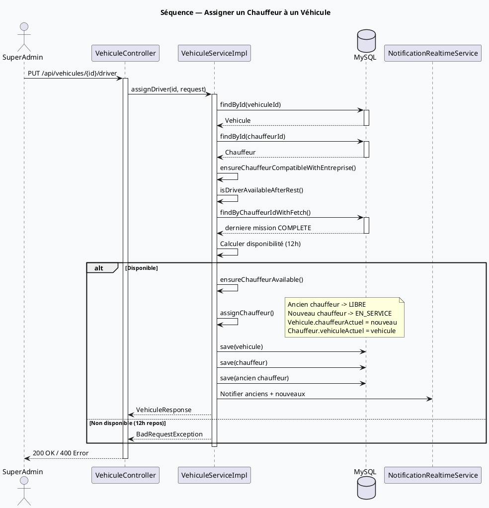
```plantuml
@startuml Seq_Assign_Driver
skinparam backgroundColor #F8F9FA
skinparam defaultFontName Arial

title **Séquence — Assigner un Chauffeur à un Véhicule**

actor "SuperAdmin" as SA
participant "VehiculeController" as VC
participant "VehiculeServiceImpl" as VS
database "MySQL" as DB
participant "NotificationRealtimeService" as NRS

SA -> VC : PUT /api/vehicules/{id}/driver
activate VC

VC -> VS : assignDriver(id, request)
activate VS

VS -> DB : findById(vehiculeId)
activate DB
DB --> VS : Vehicule
deactivate DB

VS -> DB : findById(chauffeurId)
activate DB
DB --> VS : Chauffeur
deactivate DB

VS -> VS : ensureChauffeurCompatibleWithEntreprise()
VS -> VS : isDriverAvailableAfterRest()
VS -> DB : findByChauffeurIdWithFetch()
activate DB
DB --> VS : derniere mission COMPLETE
deactivate DB

VS -> VS : Calculer disponibilité (12h)

alt Disponible
  VS -> VS : ensureChauffeurAvailable()
  VS -> VS : assignChauffeur()
  note right
    Ancien chauffeur -> LIBRE
    Nouveau chauffeur -> EN_SERVICE
    Vehicule.chauffeurActuel = nouveau
    Chauffeur.vehiculeActuel = vehicule
  end note

  VS -> DB : save(vehicule)
  VS -> DB : save(chauffeur)
  VS -> DB : save(ancien chauffeur)

  VS -> NRS : Notifier anciens + nouveaux
  VS --> VC : VehiculeResponse
else Non disponible (12h repos)
  VS --> VC : BadRequestException
end

deactivate VS
VC --> SA : 200 OK / 400 Error
deactivate VC

@enduml
```

---

### 5.3 Soumettre une Réclamation

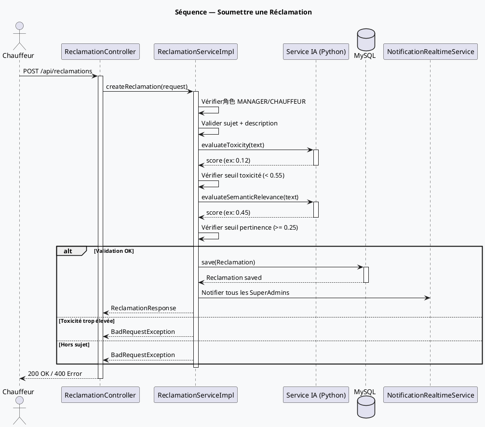
```plantuml
@startuml Seq_Create_Reclamation
skinparam backgroundColor #F8F9FA
skinparam defaultFontName Arial

title **Séquence — Soumettre une Réclamation**

actor "Chauffeur" as CH
participant "ReclamationController" as RC
participant "ReclamationServiceImpl" as RS
participant "Service IA (Python)" as AI
database "MySQL" as DB
participant "NotificationRealtimeService" as NRS

CH -> RC : POST /api/reclamations
activate RC

RC -> RS : createReclamation(request)
activate RS

RS -> RS : Vérifier角色 MANAGER/CHAUFFEUR
RS -> RS : Valider sujet + description

RS -> AI : evaluateToxicity(text)
activate AI
AI --> RS : score (ex: 0.12)
deactivate AI

RS -> RS : Vérifier seuil toxicité (< 0.55)

RS -> AI : evaluateSemanticRelevance(text)
activate AI
AI --> RS : score (ex: 0.45)
deactivate AI

RS -> RS : Vérifier seuil pertinence (>= 0.25)

alt Validation OK
  RS -> DB : save(Reclamation)
  activate DB
  DB --> RS : Reclamation saved
  deactivate DB

  RS -> NRS : Notifier tous les SuperAdmins
  RS --> RC : ReclamationResponse
else Toxicité trop élevée
  RS --> RC : BadRequestException
else Hors sujet
  RS --> RC : BadRequestException
end

deactivate RS
RC --> CH : 200 OK / 400 Error
deactivate RC

@enduml
```

---

### 5.4 Traiter un Congé

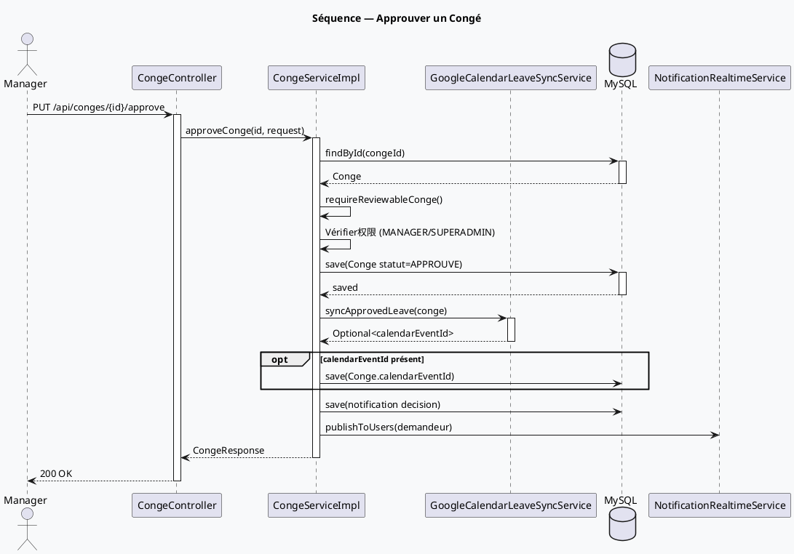
```plantuml
@startuml Seq_Approve_Leave
skinparam backgroundColor #F8F9FA
skinparam defaultFontName Arial

title **Séquence — Approuver un Congé**

actor "Manager" as M
participant "CongeController" as CC
participant "CongeServiceImpl" as CS
participant "GoogleCalendarLeaveSyncService" as GC
database "MySQL" as DB
participant "NotificationRealtimeService" as NRS

M -> CC : PUT /api/conges/{id}/approve
activate CC

CC -> CS : approveConge(id, request)
activate CS

CS -> DB : findById(congeId)
activate DB
DB --> CS : Conge
deactivate DB

CS -> CS : requireReviewableConge()
CS -> CS : Vérifier权限 (MANAGER/SUPERADMIN)

CS -> DB : save(Conge statut=APPROUVE)
activate DB
DB --> CS : saved
deactivate DB

CS -> GC : syncApprovedLeave(conge)
activate GC
GC --> CS : Optional<calendarEventId>
deactivate GC

opt calendarEventId présent
  CS -> DB : save(Conge.calendarEventId)
end

CS -> DB : save(notification decision)
CS -> NRS : publishToUsers(demandeur)

CS --> CC : CongeResponse
deactivate CS

CC --> M : 200 OK
deactivate CC

@enduml
```

---

### 5.5 Envoyer un Message Messenger

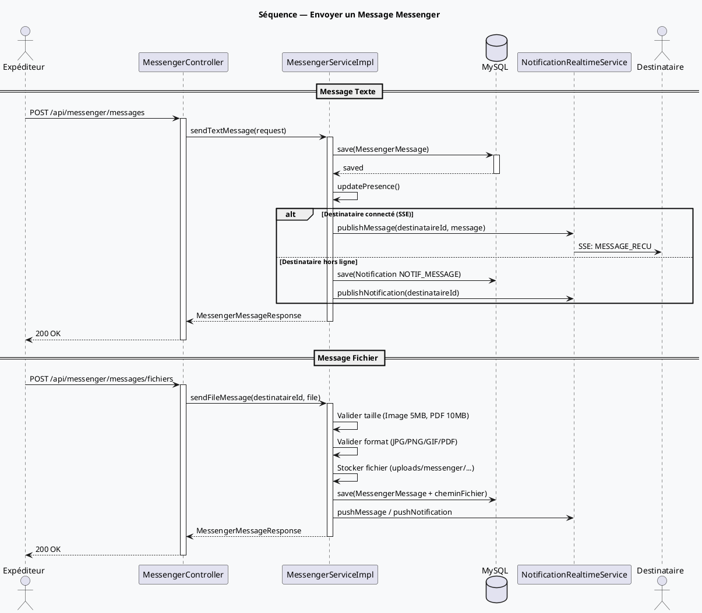
```plantuml
@startuml Seq_Send_Message
skinparam backgroundColor #F8F9FA
skinparam defaultFontName Arial

title **Séquence — Envoyer un Message Messenger**

actor "Expéditeur" as EX
participant "MessengerController" as MC
participant "MessengerServiceImpl" as MS
database "MySQL" as DB
participant "NotificationRealtimeService" as NRS
actor "Destinataire" as DE

== Message Texte ==

EX -> MC : POST /api/messenger/messages
activate MC

MC -> MS : sendTextMessage(request)
activate MS

MS -> DB : save(MessengerMessage)
activate DB
DB --> MS : saved
deactivate DB

MS -> MS : updatePresence()

alt Destinataire connecté (SSE)
  MS -> NRS : publishMessage(destinataireId, message)
  NRS -> DE : SSE: MESSAGE_RECU
else Destinataire hors ligne
  MS -> DB : save(Notification NOTIF_MESSAGE)
  MS -> NRS : publishNotification(destinataireId)
end

MS --> MC : MessengerMessageResponse
deactivate MS

MC --> EX : 200 OK
deactivate MC

== Message Fichier ==

EX -> MC : POST /api/messenger/messages/fichiers
activate MC

MC -> MS : sendFileMessage(destinataireId, file)
activate MS

MS -> MS : Valider taille (Image 5MB, PDF 10MB)
MS -> MS : Valider format (JPG/PNG/GIF/PDF)
MS -> MS : Stocker fichier (uploads/messenger/...)

MS -> DB : save(MessengerMessage + cheminFichier)
MS -> NRS : pushMessage / pushNotification

MS --> MC : MessengerMessageResponse
deactivate MS

MC --> EX : 200 OK
deactivate MC

@enduml
```

---

### 5.6 Créer une Entreprise

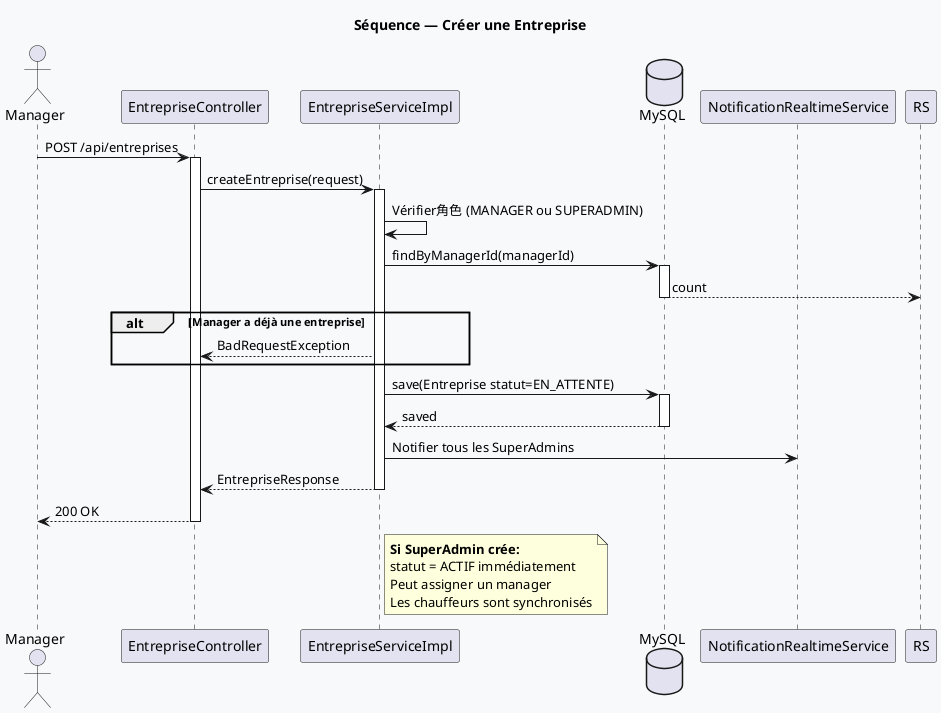
```plantuml
@startuml Seq_Create_Entreprise
skinparam backgroundColor #F8F9FA
skinparam defaultFontName Arial

title **Séquence — Créer une Entreprise**

actor "Manager" as M
participant "EntrepriseController" as EC
participant "EntrepriseServiceImpl" as ES
database "MySQL" as DB
participant "NotificationRealtimeService" as NRS

M -> EC : POST /api/entreprises
activate EC

EC -> ES : createEntreprise(request)
activate ES

ES -> ES : Vérifier角色 (MANAGER ou SUPERADMIN)

ES -> DB : findByManagerId(managerId)
activate DB
DB --> RS : count
deactivate DB

alt Manager a déjà une entreprise
  ES --> EC : BadRequestException
end

ES -> DB : save(Entreprise statut=EN_ATTENTE)
activate DB
DB --> ES : saved
deactivate DB

ES -> NRS : Notifier tous les SuperAdmins

ES --> EC : EntrepriseResponse
deactivate ES

EC --> M : 200 OK
deactivate EC

note right of ES
  **Si SuperAdmin crée:**
  statut = ACTIF immédiatement
  Peut assigner un manager
  Les chauffeurs sont synchronisés
end note

@enduml
```

---

### 5.7 Créer un Secteur

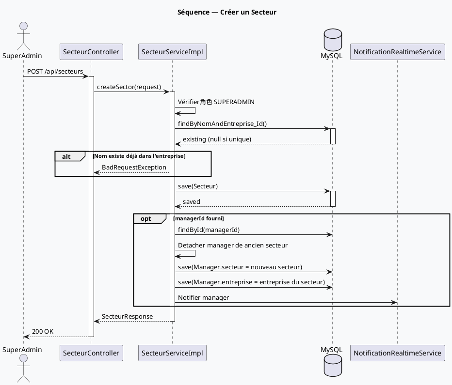
```plantuml
@startuml Seq_Create_Secteur
skinparam backgroundColor #F8F9FA
skinparam defaultFontName Arial

title **Séquence — Créer un Secteur**

actor "SuperAdmin" as SA
participant "SecteurController" as SC
participant "SecteurServiceImpl" as SS
database "MySQL" as DB
participant "NotificationRealtimeService" as NRS

SA -> SC : POST /api/secteurs
activate SC

SC -> SS : createSector(request)
activate SS

SS -> SS : Vérifier角色 SUPERADMIN
SS -> DB : findByNomAndEntreprise_Id()
activate DB
DB --> SS : existing (null si unique)
deactivate DB

alt Nom existe déjà dans l'entreprise
  SS --> SC : BadRequestException
end

SS -> DB : save(Secteur)
activate DB
DB --> SS : saved
deactivate DB

opt managerId fourni
  SS -> DB : findById(managerId)
  SS -> SS : Detacher manager de ancien secteur
  SS -> DB : save(Manager.secteur = nouveau secteur)
  SS -> DB : save(Manager.entreprise = entreprise du secteur)
  SS -> NRS : Notifier manager
end

SS --> SC : SecteurResponse
deactivate SS

SC --> SA : 200 OK
deactivate SC

@enduml
```

---

### 5.8 Démarrer et Terminer un Trajet

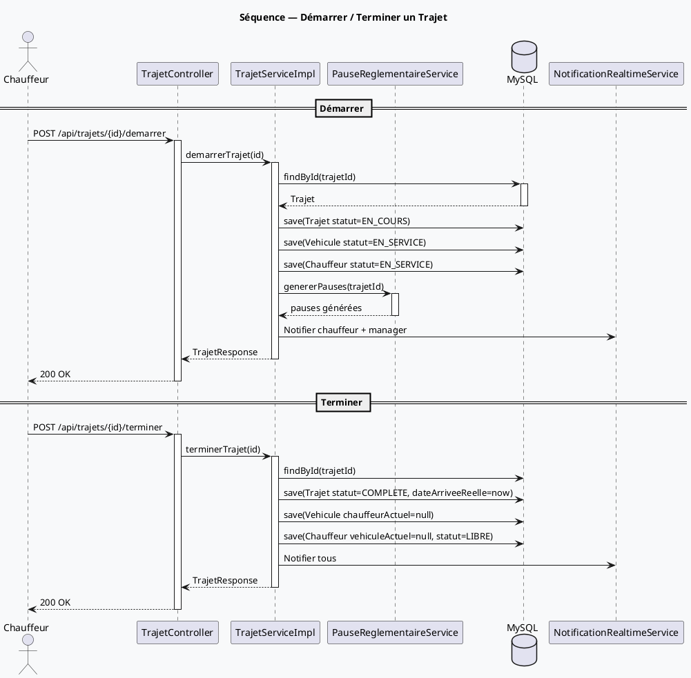
```plantuml
@startuml Seq_Start_End_Trip
skinparam backgroundColor #F8F9FA
skinparam defaultFontName Arial

title **Séquence — Démarrer / Terminer un Trajet**

actor "Chauffeur" as CH
participant "TrajetController" as TC
participant "TrajetServiceImpl" as TS
participant "PauseReglementaireService" as PRS
database "MySQL" as DB
participant "NotificationRealtimeService" as NRS

== Démarrer ==

CH -> TC : POST /api/trajets/{id}/demarrer
activate TC

TC -> TS : demarrerTrajet(id)
activate TS

TS -> DB : findById(trajetId)
activate DB
DB --> TS : Trajet
deactivate DB

TS -> DB : save(Trajet statut=EN_COURS)
TS -> DB : save(Vehicule statut=EN_SERVICE)
TS -> DB : save(Chauffeur statut=EN_SERVICE)

TS -> PRS : genererPauses(trajetId)
activate PRS
PRS --> TS : pauses générées
deactivate PRS

TS -> NRS : Notifier chauffeur + manager
TS --> TC : TrajetResponse
deactivate TS

TC --> CH : 200 OK
deactivate TC

== Terminer ==

CH -> TC : POST /api/trajets/{id}/terminer
activate TC

TC -> TS : terminerTrajet(id)
activate TS

TS -> DB : findById(trajetId)
TS -> DB : save(Trajet statut=COMPLETE, dateArriveeReelle=now)
TS -> DB : save(Vehicule chauffeurActuel=null)
TS -> DB : save(Chauffeur vehiculeActuel=null, statut=LIBRE)

TS -> NRS : Notifier tous
TS --> TC : TrajetResponse
deactivate TS

TC --> CH : 200 OK
deactivate TC

@enduml
```

---

### 5.9 Authentification Login

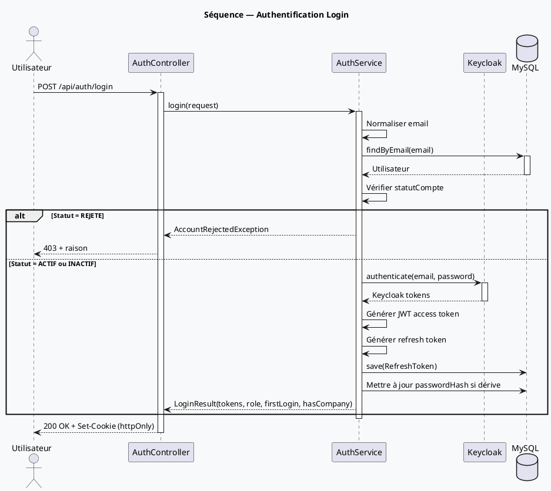
```plantuml
@startuml Seq_Login
skinparam backgroundColor #F8F9FA
skinparam defaultFontName Arial

title **Séquence — Authentification Login**

actor "Utilisateur" as U
participant "AuthController" as AC
participant "AuthService" as AS
participant "Keycloak" as KC
database "MySQL" as DB

U -> AC : POST /api/auth/login
activate AC

AC -> AS : login(request)
activate AS

AS -> AS : Normaliser email
AS -> DB : findByEmail(email)
activate DB
DB --> AS : Utilisateur
deactivate DB

AS -> AS : Vérifier statutCompte

alt Statut = REJETE
  AS --> AC : AccountRejectedException
  AC --> U : 403 + raison
else Statut = ACTIF ou INACTIF
  AS -> KC : authenticate(email, password)
  activate KC
  KC --> AS : Keycloak tokens
  deactivate KC

  AS -> AS : Générer JWT access token
  AS -> AS : Générer refresh token
  AS -> DB : save(RefreshToken)
  AS -> DB : Mettre à jour passwordHash si dérive

  AS --> AC : LoginResult(tokens, role, firstLogin, hasCompany)
end

deactivate AS
AC --> U : 200 OK + Set-Cookie (httpOnly)
deactivate AC

@enduml
```

---

## 6. Diagrammes de Cas d'Utilisation Détaillés

### 6.1 Module Véhicule

```plantuml
@startuml UC_Vehicule
skinparam backgroundColor #F8F9FA
skinparam defaultFontName Arial
skinparam usecase {
    BackgroundColor #FFFFFF
    BorderColor #2C3E50
    FontColor #2C3E50
}

title **Cas d'Utilisation — Module Véhicule**

actor "SuperAdmin" as SA
actor "Manager" as M
actor "Chauffeur" as C

rectangle "Gestion des Véhicules" {
    usecase "Consulter la liste\ndes véhicules" as UC_LIST
    usecase "Consulter un\nvéhicule" as UC_DETAIL
    usecase "Créer un\nvéhicule" as UC_CREATE
    usecase "Modifier un\nvéhicule" as UC_UPDATE
    usecase "Supprimer un\nvéhicule" as UC_DELETE
    usecase "Changer le statut\nd'un véhicule" as UC_STATUS
    usecase "Assigner un\nchauffeur" as UC_ASSIGN
    usecase "Retirer le\nchauffeur" as UC_CLEAR
    usecase "Voir les chauffeurs\ndisponibles" as UC_AVAILABLE
    usecase "Vérifier la capacité\nde la flotte" as UC_CAPACITY
    usecase "Vérifier la règle\nde 12h repos" as UC_REST
}

SA --> UC_LIST
SA --> UC_DETAIL
SA --> UC_CREATE
SA --> UC_UPDATE
SA --> UC_DELETE
SA --> UC_STATUS
SA --> UC_ASSIGN
SA --> UC_CLEAR
SA --> UC_AVAILABLE

M --> UC_LIST : "véhicules de son entreprise"
M --> UC_DETAIL : "véhicules de son entreprise"
M --> UC_STATUS : "EN_MAINTENANCE uniquement"
M --> UC_ASSIGN : "chauffeurs de son entreprise"
M --> UC_AVAILABLE

C --> UC_LIST : "son véhicule uniquement"
C --> UC_DETAIL : "son véhicule uniquement"
C --> UC_STATUS : "si assigné au véhicule"

UC_CREATE ..> UC_CAPACITY : <<include>>
UC_ASSIGN ..> UC_REST : <<include>>

@enduml
```

---

### 6.2 Module Réclamation

```plantuml
@startuml UC_Reclamation
skinparam backgroundColor #F8F9FA
skinparam defaultFontName Arial
skinparam usecase {
    BackgroundColor #FFFFFF
    BorderColor #2C3E50
    FontColor #2C3E50
}

title **Cas d'Utilisation — Module Réclamation**

actor "SuperAdmin" as SA
actor "Manager" as M
actor "Chauffeur" as C

rectangle "Gestion des Réclamations" {
    usecase "Consulter les\nréclamations" as UC_LIST
    usecase "Créer une\nréclamation" as UC_CREATE
    usecase "Modifier une\nréclamation" as UC_UPDATE
    usecase "Supprimer une\nréclamation" as UC_DELETE
    usecase "Résoudre une\nréclamation" as UC_RESOLVE
    usecase "Rejeter une\nréclamation" as UC_REJECT
    usecase "Valider le texte\n(IA)" as UC_VALIDATE
    usecase "Consulter les détails" as UC_DETAIL
}

SA --> UC_LIST : "toutes"
SA --> UC_RESOLVE
SA --> UC_REJECT
SA --> UC_DELETE : "n'importe quelle"
SA --> UC_DETAIL

M --> UC_LIST : "ses chauffeurs + sien"
M --> UC_CREATE
M --> UC_UPDATE : "si EN_COURS"
M --> UC_DELETE : "si EN_COURS"
M --> UC_DETAIL
M --> UC_VALIDATE

C --> UC_CREATE
C --> UC_UPDATE : "si EN_COURS"
C --> UC_DELETE : "si EN_COURS"
C --> UC_LIST : "les siennes"
C --> UC_DETAIL
C --> UC_VALIDATE

UC_CREATE ..> UC_VALIDATE : <<include>>

@enduml
```

---

### 6.3 Module Messenger

```plantuml
@startuml UC_Messenger
skinparam backgroundColor #F8F9FA
skinparam defaultFontName Arial
skinparam usecase {
    BackgroundColor #FFFFFF
    BorderColor #2C3E50
    FontColor #2C3E50
}

title **Cas d'Utilisation — Module Messenger**

actor "SuperAdmin" as SA
actor "Manager" as M
actor "Chauffeur" as C
actor "Utilisateur" as U

rectangle "Messagerie" {
    usecase "Voir les conversations" as UC_CONVS
    usecase "Envoyer un message\ntexte" as UC_TEXT
    usecase "Envoyer une\nimage" as UC_IMG
    usecase "Envoyer un\nPDF" as UC_PDF
    usecase "Envoyer un message\nvocal" as UC_VOCAL
    usecase "Modifier un\nmessage" as UC_EDIT
    usecase "Supprimer un\nmessage" as UC_DEL
    usecase "Marquer comme\nlu" as UC_READ
    usecase "Télécharger\nun fichier" as UC_DL
    usecase "Voir les contacts\ndisponibles" as UC_CONTACTS
    usecase "Voir le statut\n(en ligne)" as UC_STATUS
}

U <|-- SA
U <|-- M
U <|-- C

U --> UC_CONVS
U --> UC_TEXT
U --> UC_IMG
U --> UC_PDF
U --> UC_VOCAL
U --> UC_EDIT
U --> UC_DEL
U --> UC_READ
U --> UC_DL
U --> UC_CONTACTS
U --> UC_STATUS

UC_TEXT ..> UC_STATUS : <<include>>
UC_IMG ..> UC_STATUS : <<include>>
UC_PDF ..> UC_STATUS : <<include>>

@enduml
```

---

### 6.4 Module Entreprise

```plantuml
@startuml UC_Entreprise
skinparam backgroundColor #F8F9FA
skinparam defaultFontName Arial
skinparam usecase {
    BackgroundColor #FFFFFF
    BorderColor #2C3E50
    FontColor #2C3E50
}

title **Cas d'Utilisation — Module Entreprise**

actor "SuperAdmin" as SA
actor "Manager" as M

rectangle "Gestion des Entreprises" {
    usecase "Consulter les\nentreprises" as UC_LIST
    usecase "Consulter son\nentreprise" as UC_MY
    usecase "Créer une\nentreprise" as UC_CREATE
    usecase "Modifier une\nentreprise" as UC_UPDATE
    usecase "Supprimer une\nentreprise" as UC_DELETE
    usecase "Valider une\nentreprise" as UC_VALIDATE
    usecase "Changer le\npropriétaire" as UC_OWNER
    usecase "Changer le\nstatut" as UC_STATUS
    usecase "Retirer le\npropriétaire" as UC_CLEAR_OWNER
    usecase "Synchroniser\nles chauffeurs" as UC_SYNC
}

SA --> UC_LIST : "toutes"
SA --> UC_CREATE
SA --> UC_UPDATE
SA --> UC_DELETE
SA --> UC_VALIDATE
SA --> UC_OWNER
SA --> UC_STATUS
SA --> UC_CLEAR_OWNER

M --> UC_LIST : "la sienne"
M --> UC_MY
M --> UC_CREATE : "statut=EN_ATTENTE"
M --> UC_UPDATE : "si ACTIF"

UC_CREATE ..> UC_STATUS : <<include>>
UC_OWNER ..> UC_SYNC : <<include>>
UC_UPDATE ..> UC_STATUS : <<include>>

@enduml
```

---

### 6.5 Module Secteur

```plantuml
@startuml UC_Secteur
skinparam backgroundColor #F8F9FA
skinparam defaultFontName Arial
skinparam usecase {
    BackgroundColor #FFFFFF
    BorderColor #2C3E50
    FontColor #2C3E50
}

title **Cas d'Utilisation — Module Secteur**

actor "SuperAdmin" as SA
actor "Manager" as M
actor "Chauffeur" as C

rectangle "Gestion des Secteurs" {
    usecase "Consulter les\nsecteurs" as UC_LIST
    usecase "Consulter un\nsecteur" as UC_DETAIL
    usecase "Créer un\nsecteur" as UC_CREATE
    usecase "Modifier un\nsecteur" as UC_UPDATE
    usecase "Supprimer un\nsecteur" as UC_DELETE
    usecase "Assigner un\nmanager" as UC_ASSIGN_MGR
    usecase "Retirer un\nmanager" as UC_REMOVE_MGR
    usecase "Assigner un\nchauffeur" as UC_ASSIGN_CH
    usecase "Retirer un\nchauffeur" as UC_REMOVE_CH
}

SA --> UC_LIST : "tous"
SA --> UC_DETAIL
SA --> UC_CREATE
SA --> UC_UPDATE
SA --> UC_DELETE
SA --> UC_ASSIGN_MGR
SA --> UC_REMOVE_MGR
SA --> UC_ASSIGN_CH
SA --> UC_REMOVE_CH

M --> UC_LIST : "son entreprise"
M --> UC_DETAIL

C --> UC_LIST : "son secteur"

UC_DELETE ..> UC_LIST : <<extend>>\nBloqué si assignés

@enduml
```

---

### 6.6 Module Congé

```plantuml
@startuml UC_Conge
skinparam backgroundColor #F8F9FA
skinparam defaultFontName Arial
skinparam usecase {
    BackgroundColor #FFFFFF
    BorderColor #2C3E50
    FontColor #2C3E50
}

title **Cas d'Utilisation — Module Congé**

actor "SuperAdmin" as SA
actor "Manager" as M
actor "Chauffeur" as C

rectangle "Gestion des Congés" {
    usecase "Consulter les\ncongés" as UC_LIST
    usecase "Demander un\ncongé" as UC_CREATE
    usecase "Modifier une\ndemande" as UC_UPDATE
    usecase "Approuver un\ncongé" as UC_APPROVE
    usecase "Rejeter un\ncongé" as UC_REJECT
    usecase "Annuler / Supprimer\nun congé" as UC_DELETE
    usecase "Vérifier les congés\nen attente" as UC_PENDING
    usecase "Synchroniser\nGoogle Calendar" as UC_CAL
}

SA --> UC_LIST : "tous (lecture seule)"
SA --> UC_APPROVE : "demandes des Managers"
SA --> UC_REJECT : "demandes des Managers"

M --> UC_LIST : "ses chauffeurs + sien"
M --> UC_CREATE
M --> UC_UPDATE
M --> UC_APPROVE : "demandes de ses chauffeurs"
M --> UC_REJECT : "demandes de ses chauffeurs"
M --> UC_DELETE

C --> UC_CREATE
C --> UC_UPDATE
C --> UC_DELETE
C --> UC_LIST : "les siens"

UC_APPROVE ..> UC_CAL : <<include>>
UC_REJECT ..> UC_CAL : <<extend>>

@enduml
```

---

### 6.7 Module Trajet

```plantuml
@startuml UC_Trajet
skinparam backgroundColor #F8F9FA
skinparam defaultFontName Arial
skinparam usecase {
    BackgroundColor #FFFFFF
    BorderColor #2C3E50
    FontColor #2C3E50
}

title **Cas d'Utilisation — Module Trajet**

actor "SuperAdmin" as SA
actor "Manager" as M
actor "Chauffeur" as C

rectangle "Gestion des Trajets" {
    usecase "Consulter les\ntrajets" as UC_LIST
    usecase "Voir la carte\ntemps réel" as UC_MAP
    usecase "Créer un\ntrajet" as UC_CREATE
    usecase "Modifier un\ntrajet" as UC_UPDATE
    usecase "Supprimer un\ntrajet" as UC_DELETE
    usecase "Démarrer\nun trajet" as UC_START
    usecase "Terminer\nun trajet" as UC_END
    usecase "Mettre à jour\nla position GPS" as UC_GPS
    usecase "Optimiser les\ntrajets (IA)" as UC_OPTIM
    usecase "Gérer les pauses\nréglementaires" as UC_PAUSE
    usecase "Vérifier la règle\nde 12h repos" as UC_REST
    usecase "Recevoir alertes\nmétéo" as UC_WEATHER
}

SA --> UC_LIST : "tous"
SA --> UC_MAP
SA --> UC_CREATE
SA --> UC_UPDATE
SA --> UC_DELETE
SA --> UC_OPTIM
SA --> UC_PAUSE

M --> UC_LIST : "ses chauffeurs"
M --> UC_MAP
M --> UC_CREATE
M --> UC_UPDATE
M --> UC_DELETE
M --> UC_OPTIM
M --> UC_PAUSE

C --> UC_LIST : "les siens"
C --> UC_MAP : "les siens"
C --> UC_START
C --> UC_END
C --> UC_GPS
C --> UC_PAUSE
C --> UC_WEATHER

UC_CREATE ..> UC_REST : <<include>>
UC_START ..> UC_PAUSE : <<include>>
UC_GPS ..> UC_WEATHER : <<include>>

@enduml
```

---

### 6.8 Module Authentification

```plantuml
@startuml UC_Auth
skinparam backgroundColor #F8F9FA
skinparam defaultFontName Arial
skinparam usecase {
    BackgroundColor #FFFFFF
    BorderColor #2C3E50
    FontColor #2C3E50
}

title **Cas d'Utilisation — Authentification**

actor "Visiteur" as V
actor "Utilisateur" as U

rectangle "Authentification" {
    usecase "Se connecter" as UC_LOGIN
    usecase "Se déconnecter" as UC_LOGOUT
    usecase "Rafraîchir le\ntoken" as UC_REFRESH
    usecase "Demander la\nréinitialisation\ndu mot de passe" as UC_FORGOT
    usecase "Réinitialiser\nle mot de passe" as UC_RESET
    usecase "Vérifier l'email" as UC_VERIFY
    usecase "Voir la raison\nde rejet" as UC_REJECT
    usecase "Consulter le\nprofil" as UC_PROFILE
    usecase "Modifier le\nprofil" as UC_UPDATE_PROFILE
    usecase "Changer le\nmot de passe" as UC_CHANGE_PWD
}

U <|-- V : <<include>>

V --> UC_LOGIN
V --> UC_FORGOT
V --> UC_RESET
V --> UC_VERIFY
V --> UC_REJECT

U --> UC_LOGOUT
U --> UC_REFRESH
U --> UC_PROFILE
U --> UC_UPDATE_PROFILE
U --> UC_CHANGE_PWD

UC_LOGIN ..> UC_REFRESH : <<include>>
UC_LOGIN ..> UC_REJECT : <<extend>>\nsi compte REJETE

@enduml
```

---

### 6.9 Module Notification

```plantuml
@startuml UC_Notification
skinparam backgroundColor #F8F9FA
skinparam defaultFontName Arial
skinparam usecase {
    BackgroundColor #FFFFFF
    BorderColor #2C3E50
    FontColor #2C3E50
}

title **Cas d'Utilisation — Module Notification**

actor "SuperAdmin" as SA
actor "Manager" as M
actor "Chauffeur" as C

rectangle "Système de Notifications" {
    usecase "Consulter\nles notifications" as UC_LIST
    usecase "Consulter les\nnon-lues" as UC_UNREAD
    usecase "Recevoir en\ntemps réel (SSE)" as UC_SSE
    usecase "Marquer comme\nlu" as UC_MARK_READ
    usecase "Filtrer par\ntype" as UC_FILTER
}

SA --> UC_LIST : "toutes"
SA --> UC_UNREAD
SA --> UC_SSE
SA --> UC_MARK_READ
SA --> UC_FILTER

M --> UC_LIST : "ses chauffeurs"
M --> UC_UNREAD
M --> UC_SSE
M --> UC_MARK_READ
M --> UC_FILTER

C --> UC_LIST : "les siennes"
C --> UC_UNREAD
C --> UC_SSE
C --> UC_MARK_READ
C --> UC_FILTER

@enduml
```

---

### 6.10 Dashboard et Rapports

```plantuml
@startuml UC_Dashboard
skinparam backgroundColor #F8F9FA
skinparam defaultFontName Arial
skinparam usecase {
    BackgroundColor #FFFFFF
    BorderColor #2C3E50
    FontColor #2C3E50
}

title **Cas d'Utilisation — Dashboard et Rapports**

actor "SuperAdmin" as SA
actor "Manager" as M
actor "Chauffeur" as C

rectangle "Tableau de bord et Rapports" {
    usecase "Consulter le\ndashboard KPI" as UC_KPI
    usecase "Consulter le\ndashboard chauffeur" as UC_DRIVER_DASH
    usecase "Générer un\nrapport congés" as UC_R_CONGE
    usecase "Générer un\nrapport absences" as UC_R_ABSENCE
    usecase "Générer un\nrapport réclamations" as UC_R_RECLAM
    usecase "Générer un\nrapport véhicules" as UC_R_VEHI
    usecase "Générer un\nrapport trajets" as UC_R_TRAJET
    usecase "Générer un\nrapport global" as UC_R_GLOBAL
    usecase "Générer un rapport\nvia langage naturel" as UC_R_NLU
    usecase "Télécharger\nun rapport" as UC_DL_RAPPORT
    usecase "Consulter\nles pauses IA" as UC_PAUSE_AI
    usecase "Exporter les stats\n(CSV)" as UC_EXPORT
}

SA --> UC_KPI
SA --> UC_R_CONGE
SA --> UC_R_ABSENCE
SA --> UC_R_RECLAM
SA --> UC_R_VEHI
SA --> UC_R_TRAJET
SA --> UC_R_GLOBAL
SA --> UC_R_NLU
SA --> UC_DL_RAPPORT
SA --> UC_PAUSE_AI
SA --> UC_EXPORT

M --> UC_KPI
M --> UC_R_CONGE
M --> UC_R_ABSENCE
M --> UC_R_RECLAM
M --> UC_R_VEHI
M --> UC_R_TRAJET
M --> UC_R_GLOBAL
M --> UC_R_NLU
M --> UC_DL_RAPPORT
M --> UC_PAUSE_AI
M --> UC_EXPORT

C --> UC_DRIVER_DASH
C --> UC_PAUSE_AI

UC_R_NLU ..> UC_DL_RAPPORT : <<include>>
UC_KPI ..> UC_EXPORT : <<extend>>

@enduml
```

---

> **Document généré le** : 25/06/2026  
> **Outil** : PlantUML  
> **Fichiers** : Copier chaque bloc `@startuml ... @enduml` dans un éditeur PlantUML (https://www.plantuml.com/plantuml/uml/) pour générer les diagrammes.
